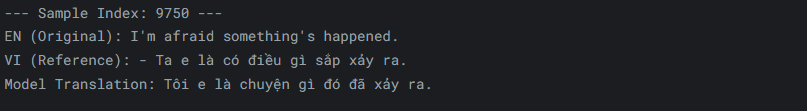
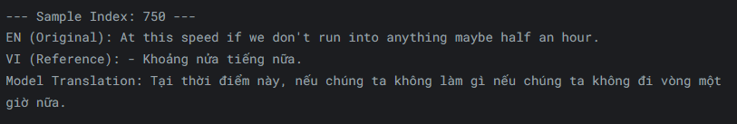

# 🌐🔤 MachineTranslation

Experiments and utilities for Machine Translation (MT).  
Build, train, and showcase translation models with a simple, extensible scaffold.

<p align="center">
  <a href="https://github.com/lehau007/MachineTranslation/stargazers">
    
  </a>
  <a href="https://github.com/lehau007/MachineTranslation/network/members">
    
  </a>
  <a href="https://github.com/lehau007/MachineTranslation/issues">
    
  </a>
  <a href="https://github.com/lehau007/MachineTranslation">
    
  </a>
</p>

---

## 🖼️ Demo

Example outputs located in the [Images](Images/) folder:

<p align="center">
  
  
</p>

---

## ✨ Highlights

- 🧠 Flexible scaffold for MT experiments (notebooks or scripts)
- ⚙️ Easy-to-extend pipeline for data, training, and inference
- 📊 Visualize qualitative results directly in the repo
- 📦 Keep everything lightweight and reproducible

---

## 📂 Repository Structure

```text
.
├── Images/
│   ├── demo1.png
│   └── demo2.png
├── data/
├── enhanced_model/
├── model/
├── train/
├── translate/
├── create_api.py
├── main.py
└── README.md
```

---

## 🚀 Getting Started

- Clone the repository:
  ```bash
  git clone https://github.com/lehau007/MachineTranslation.git
  cd MachineTranslation
  ```

- Set up your environment (choose venv/conda/poetry).

- Install project dependencies: transformers, torch

---

## 🤝 Contributing

Contributions are welcome!  
Please open an issue or pull request with improvements. Include concise descriptions and, where possible, small, reproducible examples.

---

## 🔑 License
Apache 2.0
